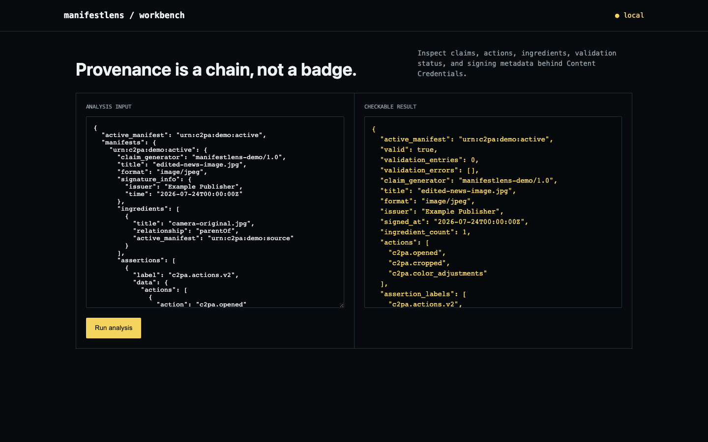

# manifestlens

**"This image has a Content Credential" tells you nothing until someone actually reads what's inside it.**


C2PA manifests are how a growing set of cameras, editors, and publishers attach a cryptographically signed edit history to an image or video — but a manifest existing isn't the same as a manifest saying anything reassuring. The same signed structure can mean "straight out of camera, untouched" or "opened, cropped, and color-graded by someone with a valid signature." manifestlens reads the actual claim: which actions were performed, whether the ingredient chain traces back to a parent asset, whether the hash binding that ties the manifest to the pixels is even present.



## How it works

Resolve the active manifest, walk its assertions for the C2PA actions list (opened, cropped, color-adjusted, and so on), check for a parent ingredient reference, and confirm a hash-binding assertion is present — that's the part that actually cryptographically ties the manifest to this specific asset rather than just being metadata sitting next to it. For real files, it hands off to the official `c2pa-python` SDK instead of reimplementing manifest parsing from scratch.

## What ships

- Full action, ingredient, and signature extraction from a C2PA manifest store
- Hard-binding detection — whether the manifest is actually tied to the asset, not just adjacent to it
- Real signed-asset inspection through the official `c2pa-python` reader, not a custom parser
- CLI, JSON API, browser workbench, Docker, tests, and CI

## Run it end to end

```bash
python -m venv .venv && source .venv/bin/activate
python -m pip install -e .
manifestlens demo
manifestlens inspect demo/C_with_CAWG_data.jpg
manifestlens serve
```

Open <http://127.0.0.1:8090>. Analyze your own JSON input with `manifestlens analyze input.json`.

## API

- `GET /api/demo` returns the committed fixture and result.
- `POST /api/analyze` runs the same engine on a JSON body.

## The result

The demo manifest resolves to one parent ingredient, three declared edits (opened, cropped, color-adjusted), an issuer and signing timestamp, and a confirmed hard-binding assertion — a complete, honest edit history, not a blank "trust me" badge. The test suite doesn't stop at the synthetic fixture: it reads a real, officially signed `C_with_CAWG_data.jpg` sample through the actual C2PA SDK.

## Update: fixed a fail-open bug on missing validation data

`analyze()` treated an *absent* `validation_status` field the same as an
*empty* one — both defaulted to `[]`, so `valid` came out `True` either
way. That's wrong: an empty list (after real validation ran) means "no
errors found," but a missing key means no cryptographic check happened at
all. Any caller — or an attacker crafting a payload for `/api/analyze` —
could mark a completely unverified manifest `valid: true` just by
omitting the field, which defeats the entire point of a provenance
validator.

Separately, `has_hard_binding` only checked whether a `c2pa.hash*`
assertion *label* was present in the manifest, not whether that specific
binding check actually passed. A manifest whose `validation_status`
explicitly reported a hash mismatch (a real tampering signal) still
reported `has_hard_binding: true` — misleading for a field the README
calls "the part that actually cryptographically ties the manifest to
this specific asset."

Fixed both: `validation_status_present` now distinguishes "absent" from
"empty," and `valid` requires the status to have actually been supplied.
`has_hard_binding` now also requires that no reported error concerns
hashing or data binding specifically — an unrelated validation error
(e.g. an expired signing credential) no longer falsely clears a genuinely
intact binding. `tests/test_validation_status_fail_open.py` covers both
directions. The published demo output is unaffected; the real-asset
integration test (which reads the real `c2pa-python` SDK output,
verified to include a populated `validation_status`) is unaffected too.

## Scope

A valid, hard-bound Content Credential proves the manifest is genuinely tied to this asset and hasn't been swapped onto a different one. It does not prove the depicted event actually happened, that the signer is trustworthy, or that unsigned content is false — provenance and truth are different claims.

## Test

The integration fixture is the signed `C_with_CAWG_data.jpg` sample from the Apache-2.0/MIT-licensed [contentauth/c2pa-python](https://github.com/contentauth/c2pa-python) repository.

```bash
python -m unittest discover -s tests -v
```

## Research basis

- [C2PA manifest model](https://opensource.contentauthenticity.org/docs/manifest/understanding-manifest/)

MIT licensed.
